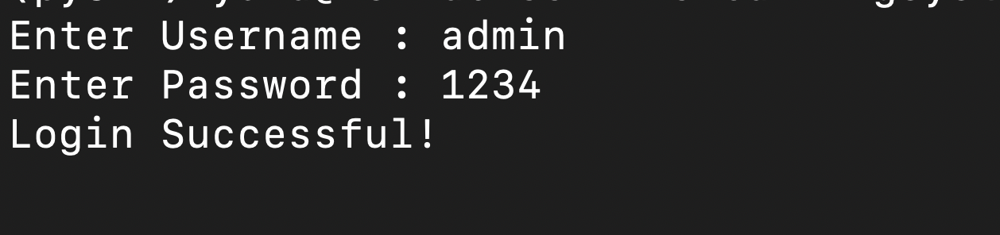
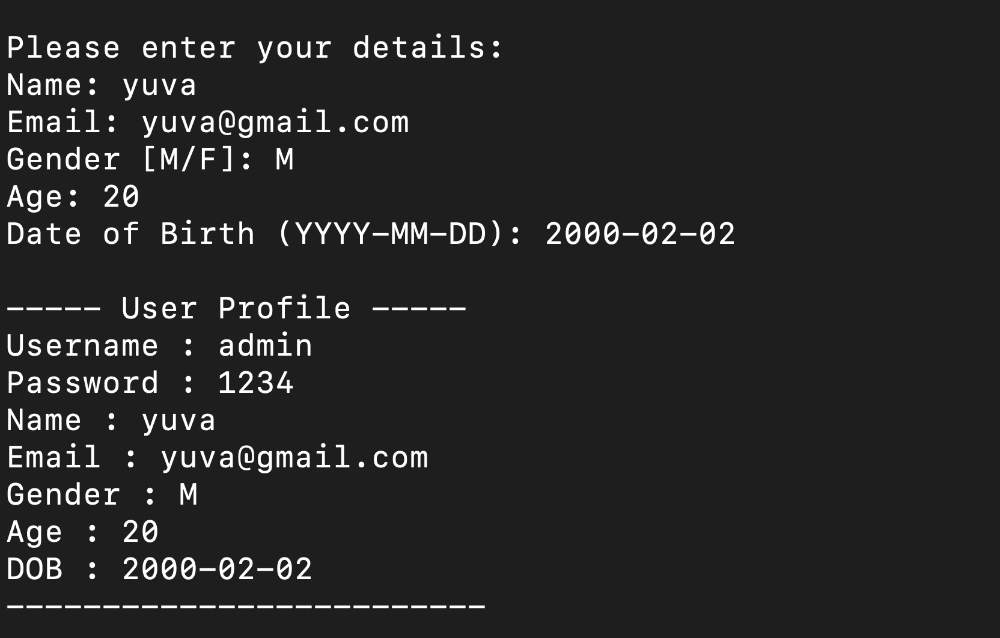

# BankingSystem-L2

A simple banking system where users can log in and input personal details to create and view their profile.

## Features

- **Login**: Secure login using username and password.
- **User Profile**: Users can enter their personal details such as Name, Email, Gender, Age, and Date of Birth.
- **Profile Display**: Once logged in, the system displays the user's profile with all the entered details.

## Screenshots

### Login Screen

Below is a screenshot of the login screen where users can enter their username and password:



### User Profile Screen

Once logged in, the user will be prompted to enter their personal details. Here is an example of the profile screen:



## Project Setup

1. Clone the repository:

    ```bash
    git clone https://github.com/yuvaxo/BankingSystem-L2.git
    ```

2. Navigate to the project folder:

    ```bash
    cd BankingSystem-L2
    ```

3. Install the required dependencies:

    ```bash
    pip install -r requirements.txt
    ```

4. Run the main application:

    ```bash
    python app.py
    ```

## Usage

1. When prompted, enter the login credentials:
    ```
    Enter Username: admin
    Enter Password: 1234
    ```

    If the credentials are correct, you will see:
    ```
    Login Successful!
    ```

2. After a successful login, you will be prompted to enter the following user details:
    ```
    Please enter your details:
    Name: yuva
    Email: yuva@gmail.com
    Gender [M/F]: M
    Age: 20
    Date of Birth (YYYY-MM-DD): 2000-02-02
    ```

3. Once entered, the system will display your profile:
    ```
    ----- User Profile -----
    Username  : admin
    Password  : 1234
    Name      : yuva
    Email     : yuva@gmail.com
    Gender    : M
    Age       : 20
    DOB       : 2000-02-02
    -------------------------
    ```

## License

This project is licensed under the MIT License - see the [LICENSE](LICENSE/LICENSE) file for details.

## Acknowledgments

- Thanks to Python and its libraries for making the development process simple and effective.
